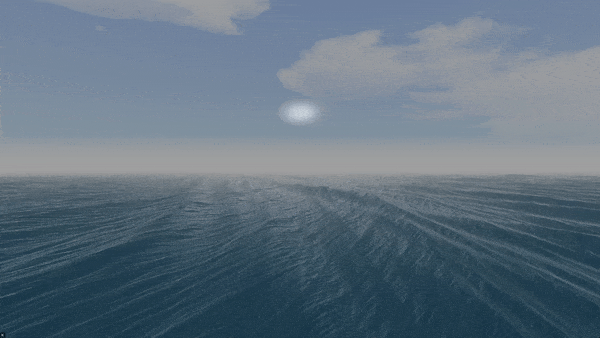

# Vulkan Water Renderer




This is a Vulkan water rendering sample scene that I made in C++ and is heavily inspired the water rendering chapters from Nvidia's [GPU Gems](https://developer.nvidia.com/gpugems/gpugems/part-i-natural-effects/chapter-1-effective-water-simulation-physical-models).

The demo contains a FPS camera that lets you explore an endlessly water surface, it also contains a ImGUI window where you can either select from 2 types of water or adjust the shader parameters.

# [Video demonstration](https://www.youtube.com/watch?v=oVUQuddr_cI)


# How it works

Water waves are being generated using Fractional Brownian Motion and sine waves over a flat surface. In a vertex shader FBM sine waves are aded to the flat surface generating amplitud, then normals are recalculated for proper shading.

To make water surface infinite, a compute shaders dispatches water "chunks" that then are populated with vertices in a tessellation shader. The number of vertices added will depend on distance from camera.

So, the rendering pipeline will consists only of rendering a skybox, then dispatching a compute shader and a single multi draw indirect command after the computer shader has finished.

# Shading

The shader renderer uses Cook-Torrance PBR model as explained in Learn Opengl's (PBR tutorial)[https://learnopengl.com/PBR/Theory].

In addition, there is an IBL model that uses reflections from a skybox to enhace visuals.

Finally, normal are calculated not just per vertex, but per pixels to make low vertex "chunks" less noticeable, which have proven to greatly improve visuals while also getting more FPS.

# Build

The project have been built with CMake and all it's dependencies except from vulkan SDK are present in the vendor directory.

Building have been tested on both Linux (Ubuntu) and Windows 11 using Visual Studio and Visual Studio code CMake Tools.

Due to recent changes in GCC I was no longer able to build it in Ubuntu, to fix it I added some ugly macro definitions before including any vulkan hpp headers, hopefully I will be able to fix it when I get more info of what is causing the error.

On linux, assuming you have CMake and gcc installed, you can build it with the following commands:

```
mkdir build
cd build
cmake ..
make
```
