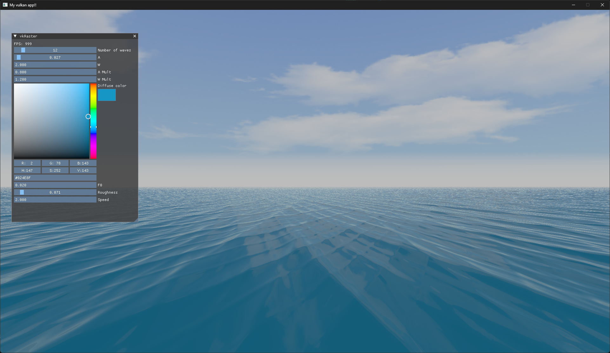

# Vulkan Water Renderer


Water renderer using sine functions and Fractional Brownian Motion.

I'm basing this project in [chapter 1 of GPU Gems](https://developer.nvidia.com/gpugems/gpugems/contributors) where they explain a common real time water rendering approach.

For wave generation there are two functions, one being the wave height calculation, called per vertex and other being the normal generation, called per fragment in order to increase image details in water without adding a lot of vertices.

For vertex processing tessellation is also used, a compute shader will generate water patches surrounding the camera and the tessellation shaders will increase resolution the closer the patches are to camera.

BDRF function is used for lighting and reflections, with one directional light coming from the sun and a environmental lighting and reflections from an environment map.

The project allows now to configure it's parameters at runtime, allowing to make other types of water such as still water.



# Build

The project have been built with CMake and all it's dependencies except from vulkan SDK are present in the vendor directory.

Building have been tested on both Linux (Ubuntu) and Windows 11 using Visual Studio and Visual Studio code CMake Tools.

On linux, assuming you have CMake and gcc installed, you can build it with the following commands:

```
mkdir build
cd build
cmake ..
make
```
